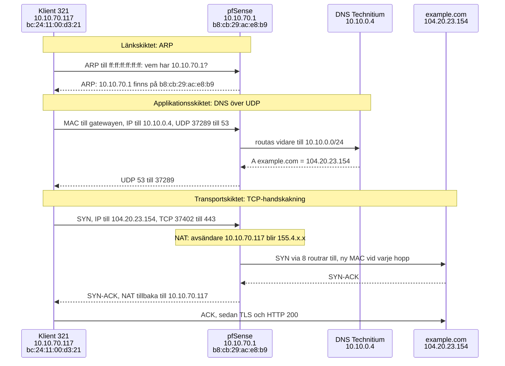

# Trafikflödet från klient till internet

Uppgiften säger att rapporten ska "rita och förklara ett komplett
datatrafikflöde från en klient i labbmiljön, genom lokalt subnät, via
gateway/router och DNS-uppslagning, ända fram till en målserver i
molnet/internet", och visa hur MAC, IP och port "ändras eller används på
respektive skikt i TCP/IP-modellen".

Klienten är Linuxservern iscx26-vg-linux (VM 321). Mätningarna gjordes när
den hade adressen 10.10.70.117. Maskinen har sedan byggts om vid
återställningsprovet och har nu 10.10.70.120, men flödet är detsamma. Målet är example.com,
en domän som är reserverad för exempel och dokumentation (RFC 2606). Alla
utskrifter kommer från kommandon som kördes på klienten den 30 september
2026. Min publika adress är maskad.

## Miljön

| Roll | IP | MAC | Nät |
|---|---|---|---|
| Klient, VM 321 | 10.10.70.117/24 | bc:24:11:00:d3:21 | VLAN 70, 10.10.70.0/24 |
| Gateway, pfSense | 10.10.70.1 | b8:cb:29:ac:e8:b9 | VLAN 70 |
| DNS, Technitium | 10.10.0.4 | syns inte från klienten | 10.10.0.0/24 |
| Mål, example.com | 104.20.23.154 | syns inte från klienten | internet |

## Flödet



## 1. Utgångsläget

```text
$ ip -br addr show ens18
ens18            UP             10.10.70.117/24 metric 100 fe80::be24:11ff:fe00:d321/64
$ ip route
default via 10.10.70.1 dev ens18 proto dhcp src 10.10.70.117 metric 100
10.10.0.4 via 10.10.70.1 dev ens18 proto dhcp src 10.10.70.117 metric 100
10.10.70.0/24 dev ens18 proto kernel scope link src 10.10.70.117 metric 100
10.10.70.1 dev ens18 proto dhcp scope link src 10.10.70.117 metric 100
$ resolvectl status ens18 | grep -E 'Current DNS|DNS Servers'
Current DNS Server: 10.10.0.4
       DNS Servers: 10.10.0.4
```

Klienten fick sin adress, gateway och DNS-server från DHCP. Det syns på
`proto dhcp` i routingtabellen och i DHCP-lånet på klienten:

```text
$ sudo cat /run/systemd/netif/leases/* | grep -E '^(ADDRESS|ROUTER|DNS|ROUTES)'
ADDRESS=10.10.70.117
ROUTER=10.10.70.1
DNS=10.10.0.4
```

DHCP-servern gav klienten adressen 10.10.70.117/24, gatewayen 10.10.70.1 och
DNS-servern 10.10.0.4. Någon väg skickades inte, eftersom `ROUTES` saknas i
lånet. Vägen till DNS-servern (10.10.0.4 via 10.10.70.1) lade klienten till
själv: systemd-networkd skapar en väg till varje DNS-server den får från DHCP
(`RoutesToDNS=`, på som standard).

`default via 10.10.70.1` är standardvägen. Allt som inte matchar någon mer
specifik rad i tabellen skickas till gatewayen 10.10.70.1, som vidarebefordrar
det till andra nät.

`10.10.70.0/24 ... scope link` betyder att adresserna 10.10.70.0 till
10.10.70.255 finns på samma länk som klienten. Dit skickas ramar direkt till
mottagarens MAC-adress, utan router. Raden har `proto kernel` eftersom kärnan
skapade den automatiskt när adressen sattes på ens18.

10.10.0.4 ligger i ett annat nät än klienten och kan inte nås direkt på
länken. Därför skickar klienten ramen till gatewayens MAC-adress, och routern
för paketet vidare till 10.10.0.0/24. Samma sak händer i omvänd riktning. Det
är därför svaret har gatewayens MAC-adress, b8:cb:29:ac:e8:b9, som avsändare.

## 2. ARP: gatewayens MAC-adress

```text
$ sudo timeout 6 tcpdump -eni ens18 arp &
$ sleep 2; sudo ip neigh flush dev ens18; ping -c1 10.10.70.1; wait
bc:24:11:00:d3:21 > ff:ff:ff:ff:ff:ff, ethertype ARP (0x0806), length 42: Request who-has 10.10.70.1 tell 10.10.70.117, length 28
b8:cb:29:ac:e8:b9 > bc:24:11:00:d3:21, ethertype ARP (0x0806), length 56: Reply 10.10.70.1 is-at b8:cb:29:ac:e8:b9, length 42
```

Klienten vet gatewayens IP-adress (10.10.70.1) men inte dess MAC-adress.
Därför skickar den frågan till broadcast-adressen ff:ff:ff:ff:ff:ff, så att
alla på nätet tar emot den. Bara den som har 10.10.70.1 svarar. Frågan
innehåller klientens egen MAC-adress, så gatewayen vet vart svaret ska och
kan skicka det direkt till bc:24:11:00:d3:21 (unicast).

En ram kan bara skickas till en MAC-adress på den egna länken. Målet, till
exempel 10.10.0.4, ligger i ett annat nät, så klienten lägger mål-IP:n i
IP-huvudet men gatewayens MAC-adress i Ethernet-huvudet. Gatewayen tar emot
ramen och skickar paketet vidare mot rätt nät. Klienten frågar alltså aldrig
efter DNS-serverns MAC-adress. Routingtabellen säger att vägen går via
10.10.70.1, och det är den adressen klienten slår upp med ARP.

## 3. DNS: namnet blir en adress

```text
$ sudo timeout 8 tcpdump -eni ens18 port 53 &
$ sleep 2; dig @10.10.0.4 example.com A +noall +answer; wait
bc:24:11:00:d3:21 > b8:cb:29:ac:e8:b9, ethertype IPv4 (0x0800), length 94: 10.10.70.117.37289 > 10.10.0.4.53: 26156+ [1au] A? example.com. (52)
example.com.            280     IN      A       104.20.23.154
example.com.            280     IN      A       172.66.147.243
b8:cb:29:ac:e8:b9 > bc:24:11:00:d3:21, ethertype IPv4 (0x0800), length 114: 10.10.0.4.53 > 10.10.70.117.37289: 26156 2/0/1 A 104.20.23.154, A 172.66.147.243 (72)
```

Samma prov mot en DNS-server på internet gav samma avsändar-MAC på svaret:

| DNS-server | Svarets käll-IP | Svarets käll-MAC |
|---|---|---|
| Google | 8.8.8.8 | b8:cb:29:ac:e8:b9 |
| Labbens | 10.10.0.4 | b8:cb:29:ac:e8:b9 |

En MAC-adress gäller bara inom den egna länken, och DNS-servern
(10.10.0.0/24) och klienten (10.10.70.0/24) ligger i olika nät, så serverns
ram kan inte nå klienten direkt. Den sista enheten är routern
(standard-gatewayen) mellan näten. Den tar emot paketet, packar det i en ny
ram och sätter sin egen MAC-adress på klientnätet, b8:cb:29:ac:e8:b9, som
avsändare. IP-adressen 10.10.0.4 följer däremot med oförändrad hela vägen.

Port 53 är DNS-serverns fasta port, där den lyssnar efter frågor. Port 37289
är en tillfällig port som klienten valde slumpmässigt för just den här
frågan. Svaret skickas tillbaka till samma port, så att klienten vet att
svaret hör till frågan. Därför byts portarna plats i svaret:
10.10.0.4.53 > 10.10.70.117.37289.

Den slumpmässiga porten skyddar också mot förfalskade svar. Den som vill lura
klienten med ett falskt svar måste gissa både porten och DNS-id:t (26156).

En DNS-fråga och ett svar är små och ryms i ett paket vardera. UDP behöver
ingen uppkoppling, så hela utbytet tar bara två paket. Med TCP hade det
krävts en handskakning i tre steg först. Om svaret är för stort för UDP
sätter servern TC-flaggan (truncated), och klienten frågar igen över TCP på
samma port 53. `[1au]` i frågan betyder att klienten använder EDNS och kan ta
emot större UDP-svar än de klassiska 512 byten.

## 4. TCP: anslutningen till webbservern

```text
$ sudo timeout 10 tcpdump -eni ens18 -c 3 'tcp port 443' &
$ sleep 2; curl -4 -s -o /dev/null -w 'HTTP %{http_code} från %{remote_ip}:%{remote_port}\n' https://example.com; wait
bc:24:11:00:d3:21 > b8:cb:29:ac:e8:b9, ethertype IPv4 (0x0800), length 74: 10.10.70.117.37402 > 104.20.23.154.443: Flags [S], seq 2890069209, win 64240, options [mss 1460,sackOK,TS val 558012701 ecr 0,nop,wscale 8], length 0
b8:cb:29:ac:e8:b9 > bc:24:11:00:d3:21, ethertype IPv4 (0x0800), length 74: 104.20.23.154.443 > 10.10.70.117.37402: Flags [S.], seq 1628277923, ack 2890069210, win 65535, options [mss 1400,sackOK,TS val 4009518647 ecr 558012701,nop,wscale 13], length 0
bc:24:11:00:d3:21 > b8:cb:29:ac:e8:b9, ethertype IPv4 (0x0800), length 66: 10.10.70.117.37402 > 104.20.23.154.443: Flags [.], ack 1, win 251, options [nop,nop,TS val 558012704 ecr 4009518647], length 0
HTTP 200 från 104.20.23.154:443
```

De tre paketen är TCP:s trevägshandskakning:

- `[S]` (SYN): klienten ber om en anslutning och skickar sitt startnummer,
  seq 2890069209.
- `[S.]` (SYN-ACK): servern godkänner, skickar sitt eget startnummer
  (seq 1628277923) och bekräftar klientens med ack 2890069210, alltså
  klientens nummer plus ett.
- `[.]` (ACK): klienten bekräftar serverns nummer. Nu är anslutningen öppen.
  tcpdump visar ack 1 eftersom den räknar relativt startnumret.

Punkten betyder att ACK-flaggan är satt.

En webbsida kan bestå av många paket som måste komma fram, i rätt ordning och
utan att något saknas. TCP ser till det genom att numrera och bekräfta allt
och skicka om det som försvinner. En DNS-fråga ryms i ett enda paket, och går
den förlorad kan klienten bara fråga igen. Där är handskakningen onödig
väntan. Här lade HTTPS sin kryptering (TLS) ovanpå TCP-anslutningen, när
handskakningen var klar.

Klienten ansluter till 104.20.23.154, den första adressen i DNS-svaret i
steg 3, på port 443, som är standardporten för HTTPS. Klienten använder den
tillfälliga porten 37402. Även här är gatewayens MAC-adress,
b8:cb:29:ac:e8:b9, avsändare på inkommande ramar, eftersom webbservern ligger
utanför klientens nät.

## 5. NAT: adressen ändras vid gatewayen

```text
$ curl -4 -s https://ifconfig.me
155.4.x.x
```

10.10.70.117 är en privat adress (RFC 1918). Den används bara inom lokala nät
och routas inte på internet. För att klienten ska kunna nå internet byter
pfSense ut avsändaradressen mot sin egen publika adress, 155.4.x.x.
Webbservern ser därför bara pfSense och vet inte att det finns en klient
bakom. Att det är pfSenses egen adress syns i pfSense under Status,
Interfaces, där WAN-gränssnittet har samma adress som ifconfig.me visar. Det
finns alltså ingen ytterligare NAT hos internetleverantören.

På vägen ut byter pfSense avsändaren från 10.10.70.117:37402 till 155.4.x.x
och en port som den väljer själv. Kopplingen mellan den gamla och den nya
adressen sparas i en tillståndstabell (state table).

På vägen tillbaka kommer svaret till 155.4.x.x och pfSenses port. pfSense
slår upp porten i tabellen, byter tillbaka mottagaren till
10.10.70.117:37402 och skickar paketet in på det lokala nätet. Det packas i
en ny ram med gatewayens MAC-adress b8:cb:29:ac:e8:b9 som avsändare. Klienten
ser aldrig bytet i sina egna paket.

Det här kallas NAT, eller mer exakt PAT/overload, eftersom många klienter
delar samma publika adress och hålls isär med hjälp av portnumren.

## 6. Vägen genom internet

```text
$ traceroute -n -q 1 104.20.23.154
traceroute to 104.20.23.154 (104.20.23.154), 30 hops max, 60 byte packets
 1  10.10.70.1  0.446 ms
 2  5.150.x.x  1.517 ms
 3  46.59.118.49  1.485 ms
 4  *
 5  46.59.114.4  6.754 ms
 6  46.59.112.106  4.907 ms
 7  46.59.112.249  5.727 ms
 8  85.24.220.20  3.613 ms
 9  46.59.116.23  3.874 ms
10  104.20.23.154  3.436 ms
```

Varje IP-paket har ett TTL-värde (Time To Live), och varje router som skickar
paketet vidare minskar det med 1. När TTL når 0 slängs paketet, och routern
skickar tillbaka ett ICMP-meddelande, Time Exceeded, med sin egen adress som
avsändare.

traceroute utnyttjar det. Först skickar den ett paket med TTL 1, som stoppas
av den första routern (10.10.70.1, pfSense). Sedan ett med TTL 2, som stoppas
av nästa router, och så vidare. Varje svar avslöjar en router på vägen. När
paketet till slut når målet (104.20.23.154) svarar målet självt, och
traceroute slutar.

`*` på hopp 4 betyder att inget svar kom inom tidsgränsen. Routern finns,
för hopp 5 och framåt svarar, men den skickar inte ICMP-svar, begränsar hur
många den skickar, eller så filtreras svaret bort. Med `-q 1` skickas bara
ett försök per hopp, så ett enda förlorat svar räcker för att det ska bli en
stjärna.

MAC-adresserna byts ut vid varje hopp. Varje router packar upp ramen, läser
IP-adressen, slår upp nästa hopp i sin routingtabell och packar paketet i en
ny ram. Den nya ramen har routerns egen MAC-adress som avsändare och nästa
routers MAC-adress som mottagare. IP-adresserna ligger kvar oförändrade.
Undantaget är pfSense i hopp 1, som också byter avsändarens IP genom NAT
(avsnitt 5).

Det här är samma sak som syntes i avsnitt 3, fast upprepat vid varje hopp:
MAC-adresser gäller bara en länk, IP-adresser gäller hela vägen.

## Vad som ändras på vägen

| Skikt i TCP/IP-modellen | Vad | Ändras på vägen? |
|---|---|---|
| Applikation | DNS-frågan, HTTPS | Nej |
| Transport | Portar: 37289 till 53, 37402 till 443 | Nej, men NAT kan byta källporten |
| Internet | IP: 10.10.70.117 till 104.20.23.154 | Bara vid NAT i pfSense, avsändaren blir 155.4.x.x |
| Länk | MAC: bc:24:11:00:d3:21 till b8:cb:29:ac:e8:b9 | Ja, vid varje hopp |

MAC-adresser och IP-adresser har olika uppgifter. En MAC-adress säger vem som
ska ta emot ramen på den här länken, och IP-adressen säger vart paketet ska
till slut. Därför packar varje router upp ramen, läser IP-adressen, väljer
nästa hopp i sin routingtabell och packar paketet i en ny ram med nya
MAC-adresser. IP-adresserna behöver ligga kvar, annars vet ingen router vart
paketet ska. Det enda undantaget i labben var pfSense, som bytte klientens
privata adress mot en publik adress med NAT.

Varje skikt har sin egen uppgift:

- Länkskiktet flyttar ramen ett steg, till nästa enhet på samma nät, med
  hjälp av MAC-adresser. ARP tar reda på vilken MAC-adress som hör till en
  IP-adress.
- Internetskiktet hittar vägen genom flera nät med hjälp av IP-adresser och
  routingtabeller. TTL hindrar paket från att cirkulera för evigt.
- Transportskiktet levererar data till rätt program med hjälp av portar. UDP
  används när det räcker med en snabb fråga och ett svar (DNS), och TCP när
  allt måste komma fram i rätt ordning (HTTPS).
- Applikationsskiktet är själva innehållet, som DNS-frågan eller webbsidan.
  Det förblir oförändrat hela vägen, och med HTTPS är det dessutom krypterat
  så att routrarna på vägen inte kan läsa det.

Skikten fungerar som kuvert i kuvert. Varje router öppnar det yttersta
kuvertet (ramen), läser adressen på nästa (IP-paketet), minskar TTL med 1 och
lägger det i ett nytt ytterkuvert. Bara pfSense skriver dessutom om adressen
och porten, med NAT. Det innersta, själva innehållet, rörs aldrig.

## Källor

- [RFC 791: IP](https://www.rfc-editor.org/rfc/rfc791), bland annat TTL
- [RFC 792: ICMP](https://www.rfc-editor.org/rfc/rfc792), bland annat Time Exceeded
- [RFC 826: ARP](https://www.rfc-editor.org/rfc/rfc826)
- [RFC 1035: DNS](https://www.rfc-editor.org/rfc/rfc1035), bland annat gränsen 512 byte och TC-flaggan
- [RFC 5452: skydd mot förfalskade DNS-svar](https://www.rfc-editor.org/rfc/rfc5452), slumpad källport och id
- [RFC 6891: EDNS](https://www.rfc-editor.org/rfc/rfc6891)
- [RFC 9293: TCP](https://www.rfc-editor.org/rfc/rfc9293)
- [RFC 1918: privata adresser](https://www.rfc-editor.org/rfc/rfc1918)
- [RFC 3022: NAT med portöversättning (NAPT)](https://www.rfc-editor.org/rfc/rfc3022)
- [RFC 2606: reserverade domäner som example.com](https://www.rfc-editor.org/rfc/rfc2606)
- [`man 5 systemd.network`](https://man7.org/linux/man-pages/man5/systemd.network.5.html): RoutesToDNS=
- [`man 8 traceroute`](https://man7.org/linux/man-pages/man8/traceroute.8.html)
